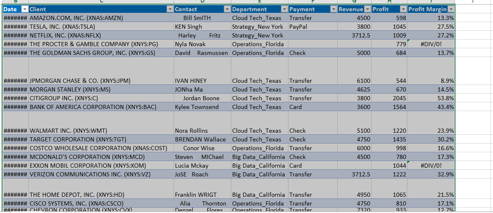
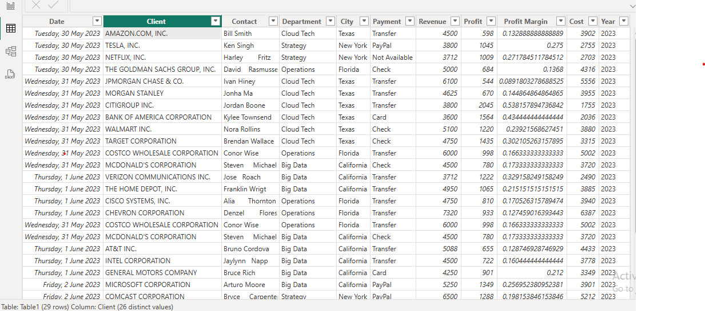
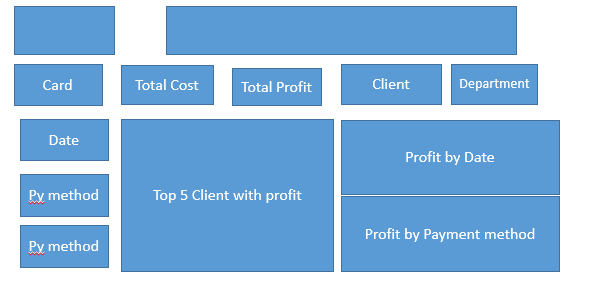
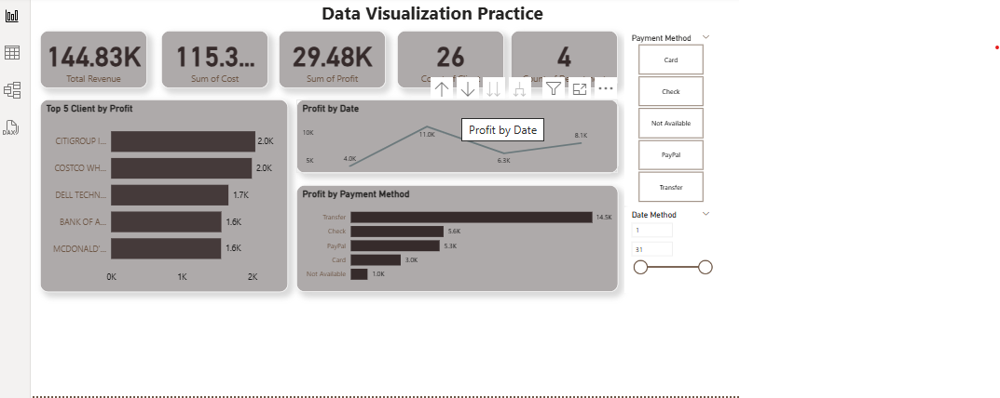

# Business Data Vitualization
## Introduction:
This project focuses on analyzing and visualizing business data to uncover insights into revenue generation. Using Excel and Powe Bi, the project transforms raw business data into interactive charts, dashboards, and reports.

## Problem Statement:
Using business data,interactive dashboards,trends and visualization will be created to answer critical questions such as:
1.  Revenue trend by period
2.  Top 5 Clients with highest revenue
3.  Names of counties and their revenue generation
4.  What is cost,revenue and revenue in total
5.  Which payment method generated most reveenue
   
The key objectives include identifying revenue trends, optimizing sales strategies, and supporting data-driven decision-making.
## Skills and Expertise Used/Gained in the Analysis Process
###Technical Skills
-  Data Cleaning & Preparation – Handled missing values, duplicates, and inconsistencies in raw business data.
-  Advanced Excel Functions – Utilized VLOOKUP, PivotTables, XLOOKUP, SUMIFS, and dynamic formulas for efficient data manipulation.
-  Data Visualization – Created interactive dashboards with Excel Charts, Slicers, and Conditional Formatting for clear insights.
-  Dashboard Development – Built dynamic, user-friendly dashboards to track KPIs like revenue, sales trends, and customer behavior,total cost and most used payment method.
-  Power Query & Power Pivot – Automated data transformation and managed large datasets efficiently.
-  
###Analytical & Business Skills
-  Revenue Analysis – Identified key drivers of revenue growth and seasonal trends.
-  Performance Metrics – Evaluated sales performance, customer segmentation, and profitability.
-  Data-Driven Decision Making – Translated insights into actionable business recommendations.
-  Report Automation – Reduced manual effort by setting up auto-updating dashboards using Slicer.
-  
###Tools Used
-  Microsoft Excel (PivotTables, Power Query, Advanced Formulas)
-  Excel Dashboards (Interactive Slicers, Charts)
-  Power BI (For advanced visualization)

These skills ensured a thorough and insightful analysis of the "Business Data Visualization" revenue performance. 

## Data Modelling
Data in Excel         |        Data in Power BI      |  My Dashboard Sketch
:--------------------:   |  :--------------------:   |  :--------------------:         
        |        |  

## Visualization
Dashboards
        
:--------------------:           
  

   ## Analysis: Key Revenue Insight for Business Data Visualization
   -  Financial Overview
     
     1.  Revenue:#144.83k| Cost:#115.35k| Profit:#29k(20% margin)
     
     2.  Top Performing Clients:
      -  Citigroup(Highest revenue generator)
      -  Costco & Dell Technology (Next revenue generator)
      
     3.  Payment method Analysis
     -   Transfer dominated revenue(#15k), 3x > card and check payment
     -   Citigroup & Costco drove 100% of transfer-based revenue.

  
     4.  Monthly Peak
    -    May recorded the highest revenue(11k).
    
     5.  Data Gap:
    -    Netflix contributed #3.71k, but payment method was unclassified(potential tracking issue)  
    -  Strategic Note: Client and Payment trends suggest transfer-based clients(Citigroup & Costco) are key Profot drivers.
       ## Recommendations and Conclusions
-  Key Takeaways:
-  Revenue Optimization: Focus on high-value clients(Citigroup, Costco, and Dell) and emulate thier success strategies and strength.
-  Payment Efficiency: Transfer method drives 3x more revenue than card and check payment- encourage more clients to use it.
-  Data Quality: Missing payment method for Netflis (3.71k) indicates a need for better tracking.
-  Cost Control: With a 20% profit margin , review expenses to further boost profitability.

  ## Strategic Actions:
  Analyze May's Peak trend to replicate success in other months.
  Upsell transfer payments to other clients to maximize revenue.
  Improve data to eliminate gaps in payment method.

  ## Final Thoughts: The Business Data Visualization has strong revenue streams, but refining client focus, payment methods ,and data processes can improve profitability further.
     
